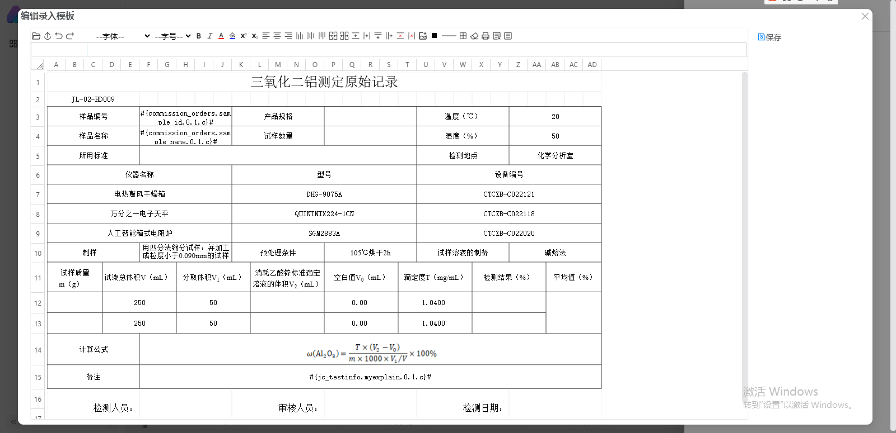
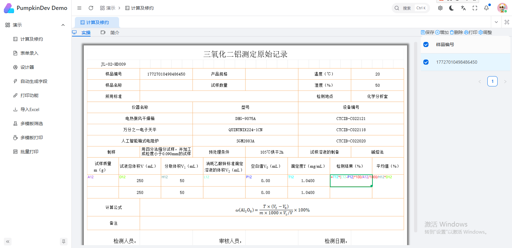

## Translations

- [English](/docs/README.en.md)

# PumpkinDesigner
纯js轻量级表格数据编辑器，作为 PumpkinDev（[www.pumpkindev.com](www.pumpkindev.com)）核心前端编辑组件，专注于**数据录入界面开发**与**打印模板设计**场景，兼顾易用性与定制化能力。

> ⚠️ 注意：本组件聚焦轻量定制化场景，若需完全复刻 Excel 全功能，该项目可能无法满足你的需求。

## 🌟 开发背景
很多客户的核心工作载体是表格，对「类 Excel 表格录入界面」有强需求，但市面上同类组件存在两大痛点：
- 商用组件成本高，且功能固化难以定制；
- 原生 Excel 风格的组件过度贴合 Excel 逻辑，无法灵活扩展业务特性（如单元格修约、自定义下拉规则等）。

因此我们打造了 PumpkinDesigner —— 既保留 Excel 友好的操作习惯，又支持高度定制化开发，兼顾界面易用性与功能可控性。

## ✨ 核心功能特点
### 1. 类 Excel 操作体验（且更灵活）
- **基础操作全覆盖**：字体样式、单元格格式、插入图片（支持单元格内嵌图、浮动图、表格背景图，其中内嵌图支持上下左右位置摆放，是Excel没有的）；
- **快捷键适配**：完美支持上下左右方向键、Enter、Tab 键，贴合日常操作习惯；
- **智能辅助功能**：自动填充、公式计算（选中公式单元格时，会显示公式及与公式对应的单元格名称，交互体验优于 Excel）；

### 2. 数据录入专属能力
- 字段与单元格双向绑定，数据联动更高效；
- 内置下拉选择、自动下拉补全、日历控件、复选框等录入组件；
- 支持自定义录入规则（如单元格修约、个性化下拉逻辑）。

### 3. 打印模板设计
- 自动填充字段、表体自动计算，适配复杂模板场景；
- 可结合报告生成组件，快速生成各类结构化/非结构化报告。

## 📸 功能截图
> 以下为核心功能展示
| 功能场景 | 截图展示 |
|----------|----------|
| 表格编辑器 |  |
| 录入界面 |  |

## 📂 项目目录说明
| 目录/文件 | 说明 |
|-----------|------|
| `Code/` | 核心代码主目录 |
| `Code/src/` | 源码目录（开发核心） |
| `Code/dist/` | 打包后产物目录 |
| `Code/testEditor_design.html` | 源码功能测试页面 |
| `Code/testEditor_min.html` | 打包后功能验证页面 |
| `Code/testFillData.html` | 数据填充功能测试页面 |
| `docs/` | 项目文档、截图等资源目录 |
| `Pack/` | JS 打包脚本项目目录 |

## 🚀 快速上手
### 1. 打包构建
执行 Python 打包脚本，生成生产环境可用的 JS 文件：
```bash
python.exe ./Pack/pack_js_cli.py ./Code
```

### 2. 开发与测试
无需复杂环境配置，直接通过浏览器打开测试文件即可验证功能：
1. 打开 `Code/testEditor_design.html`：测试源码功能完整性；
2. 打开 `Code/testEditor_min.html`：验证打包后代码是否正常运行；
3. 打开 `Code/testFillData.html`：测试数据填充、字段绑定等核心业务能力。

## 📄 开源许可
本项目采用 **MIT 开源协议**，你可自由用于商业/非商业场景，修改、分发代码无需开源衍生作品，仅需保留版权声明即可。

## 📞 关于 PumpkinDev
PumpkinDesigner 是 PumpkinDev 生态的核心组件，更多报表解决方案可访问：[www.pumpkindev.com](www.pumpkindev.com)。